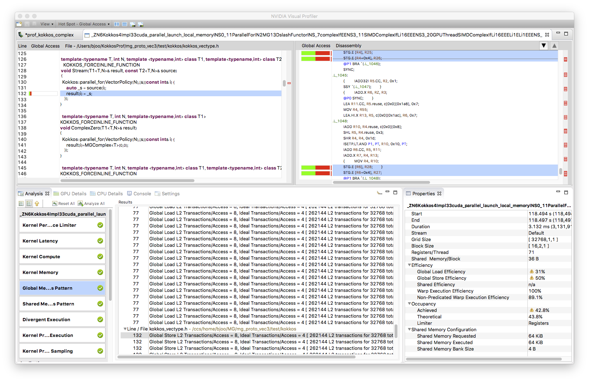
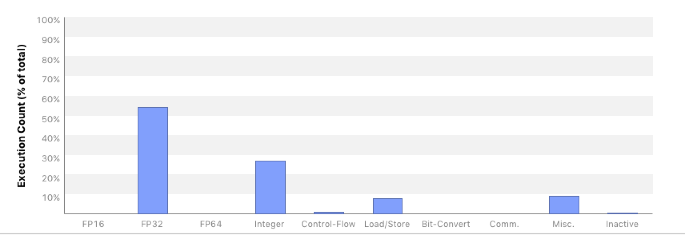
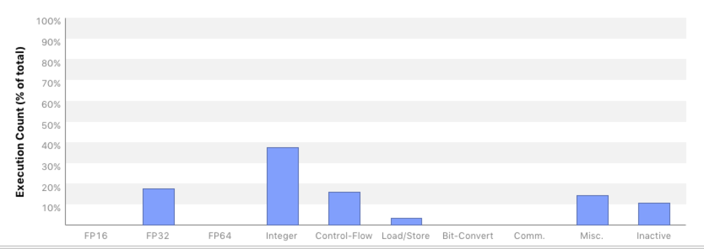

# Kokkos Implementation

In Kokkos, it is advised to use the ```Kokkos::View``` datatype as our data container. Therefore, the [spinor and gaugefield classes](./code_structure.md#Data_Primitives) become

```C++
template<typename ST,int nspin> 
class CBSpinor {
public: 
    ...
private:
    // dims are: site, color, spin
    Kokkos::View<ST*[3][nspin]> data;
};

template<typename GT> 
class CBGaugeField {
public:
    ...
private:
    // dims are: site, direction, color, color
    gauge_container<GT*[4][3][3]> data;
};
```

Note that the site index dimension is a runtime dimension (denoted by ```*```) whereas the other dimensions - color and spin - are fixed (denoted by ```[const]```). Explicitly stating this is recommended by the kokkos developers because it should help the compiler to optimize the code.

In the [Wilson operator class](./code_structure.md#wilson_operator), all what we need to do is to insert the kokkos parallel dispatcher. Hence it becomes

```C++
template<typename GT, typename ST, typename TST>
class Dslash {
    public:
    void operator(const CBSpinor<ST,4>& s_in,
                  const CBGaugeField<GT>& g_in,
                  CBSpinor<ST,4>& s_out,
                  int plus_minus) 
    {
        // Threaded loop over sites
        Kokkos::parallel_for(num_sites, KOKKOS_LAMBDA(int i) {
            ...
            });
    }
};
```

Note that since we linearized the site index, we need to compute the neighboring site indices manually. On architectures with poor integer arithmetic performance this might lead to a significant performance penalty. Therefore, we implement a neighbor class which either holds a pre-computed neighbor table or computes the site neighbor for a given direction on the fly. In our performance measurements we use the implementation which gives the best performance for a given architecture. 

## Complex Numbers and C++
We want to emphasize a subtle performance pitfall when it comes to complex numbers in C++. The language standards inhibit the compiler to efficiently optimize operations such as 

```C++
c += a * b
``` 

when ```a```, ```b``` and ```c``` are complex numbers. Naively, this expression could be expanded into 

```C++
re(c) += re(a) * re(b) - im(a) * im(b)
im(c) += re(a) * im(b) + im(a) * re(b)
``` 

where ```re(.), im(.)``` denote the real and imaginary part of its argument respectively. This expresson can nicely be packed into a total of four FMA operations per line. However, in the simplified form above which is usually used in context of operator overloading, the compier would have to evaluate the right hand side first and then sum the result into ```c```. This is much less efficient since in that case, only two FMA as well as two multiplications and additions could be used. One has to keep that in mind when doing complex algebra in C++. In many cases it is better to inline code and avoid otherwise useful operator overloading techniques for complex algebra.

## Ensuring Vectorization
Vectorization in Kokkos is achieved by a two-level [nested parallelism](../../perfport/frameworks/kokkos.md#nested-parallelism), where the outer loop spawns threads (pthreads, OpenMP-threads) on the CPU and threads in CUDA-block y-direction on the GPU. The inner loop then applies vectorization pragmas on the CPU or spwans threads in x-direction on the GPU. This is where we have to show some awareness of architectural differences: the spinor work type ```TST``` needs to be a scalar type on the GPU and a vector type on the CPU. Hence we declare the following types on GPU and CPU respectively

```C++
template<typename T,N> 
struct CPUSIMDComplex {
    Kokkos::complex<T> _data[N];
    T& operator()(int lane) {
        return _data[lane];
    }
    ...
};

template<typename T,N> 
struct GPUSIMDComplex {
    Kokkos::complex<T> _data;
    T& operator()(int lane) {
        return _data;
    }
    ...
};
```

The latter construct might look confusing first, because the access operator ignores the ```lane``` parameter. This is because the SIMT threading is implicit in Kokkos and each SIMT thread is holding it's own data ```_data```. Nevertheless, it is useful to implement the access operator that way to preserve a common, portable style throughout the rest of the code.


### Specialization for CPU
In theory, these two types are sufficient for ensuring proper vectorization on both CPU and GPU. In our experiments however, we found that neither Intel nor GNU compiler could vectorize the complex operations inside the spinors properly, leading to a very poor performance. This is not a problem of Kokkos itself, it is merely the inability of compilers to efficiently vectorized complex algebra.
We therefore provided a template  specialization for the ```CPUSIMDComplex``` datatype which we implemented by explicitly using AVX512 intrinsics. For example, the datatype then becomes

```C++
template<>
struct CPUSIMDComplex<float,8> {
    explicit CPUSIMDComplex<float,8>() {}
    
    union {
        Kokkos::complex<float> _data[8];
        __m512 _vdata;
    };
    ...
};
```

and, for example, the vectorized multiplication of two complex numbers

```C++
template<> KOKKOS_FORCEINLINE_FUNCTION
void ComplexCMadd<float,8,CPUSIMDComplex,CPUSIMDComplex>(CPUSIMDComplex<float,8>& res,
                                                         const Kokkos::complex<float>& a,
                                                         const CPUSIMDComplex<float,8>& b)
{
  __m512 avec_re = _mm512_set1_ps( a.real() );
  __m512 avec_im = _mm512_set1_ps( a.imag() );

  __m512 sgnvec = _mm512_set_ps( 1,-1,1,-1,1,-1,1,-1,1,-1,1,-1,1,-1,1,-1);
  __m512 perm_b = _mm512_mul_ps(sgnvec,_mm512_shuffle_ps(b._vdata,b._vdata,0xb1));

  res._vdata = _mm512_fmadd_ps( avec_re, b._vdata, res._vdata);
  res._vdata = _mm512_fmadd_ps( avec_im,perm_b, res._vdata);
}
```

Note that we use inter-lane shuffle operations to swap complex and imaginary parts and use vectorized FMA operations. We suspect that compilers are unable to detect the opportunity of performing those inter-lane shuffles and thus fail to properly vectorize the code. The amount of specialization employed here is contained in about 14 functions spreading across 182 lines of code. This is not a huge investment and also does not really destroy portability as most of the code is still written in a portable way.

### Specialization for GPU
Although vectorization issues are usually less severe on SIMT architectures, we ran into problems of vectorized loads and stores of complex numbers. using ```nvprof```, we found that a load and store of a ```Kokkos::complex``` instance created two transactions, i.e. one for the real and one for the imaginary part. The ```nvprof``` screenshot shown below illustrates this issue.



These *split-transactions* have the potential of wasting bandwidth and thus should be avoided. A (partial) solution is to use CUDA 9 instead of CUDA 8: apparently, the compiler improved so that it is able to remove at least all the split stores, but not all split loads.
To improve that situation, we decide to write our own complex class which we derived from the CUDA ```float2``` datatype (this is for single precision, one could use ```double2``` for double precision). By doing so, we make sure that the data member has correct alignment properties and thus helps the compiler to issue optimized store and load iterations. The implementation of this class is sketched below.

```C++
template<>
class GPUComplex<float> : public float2 { 
  public:
    explicit KOKKOS_INLINE_FUNCTION GPUComplex<float>() {
      x = 0.;
      y = 0.;
    }

    template<typename T1, typename T2>
    explicit  KOKKOS_INLINE_FUNCTION GPUComplex<float>(const T1& re, const T2& im) {
      x = re;
      y = im;
    }
    
    explicit KOKKOS_INLINE_FUNCTION GPUComplex<float>(const float& re, const float& im) {
      x = re; y = im;
    }
    
    template<typename T1>
    KOKKOS_INLINE_FUNCTION GPUComplex<float>& operator=(const GPUComplex<T1>& src) {
      x = src.x;
      y = src.y;
      return *this;
    }
    
    ...
};
```

The part abbreviated by the ellipsis only contains further assignment or access operators, no complex math. Because of the issues with complex arithmetic in C++ mentioned above, we explicitely write those operations in terms of real and imaginary parts. 
Using this class got rid of all uncoalesced data access issues even in CUDA 8. This can be inferred by looking at the ```nvprof``` output in which the corresponding sections are not marked as hotspots any more. 

Note that despite our improvements of complex load and store instructions, the kernel performance barely changed. This incidates that on the GPU the performance is still limited by something else, probably memory access latency. 

# Index Computations

Investigating this issue with ```nvprof``` indicates that performance might be impacted by significant integer calculation overhead. For example, the first screenshot below shows the instruction decomposition for the Wilson operator from the optimized [QUDA library](https://github.com/lattice/quda).



It exhibits that about 55% of all instructions are floating point instructions, there is basically no flow control and only about 28% integer arithmetic. For the Kokkos kernel ```nvprof``` shows the following picture.



This shows that our floating point instruction ratio is only 28%, whereas integer and control flow counts are notably higher, namely 38% and 15% respectively. Since we are not doing significant amounts of index calculations in our kernel bodies (i.e. inside Kokkos functors), it means that Kokkos is inserting that, probably for indexing into the views. This can hurt performance especially on older GPU architectures and also on KNL, where integer operations are not vectorized. Currently, we do not see an easy workaround as this behaviour is buried inside the Kokkos framework.