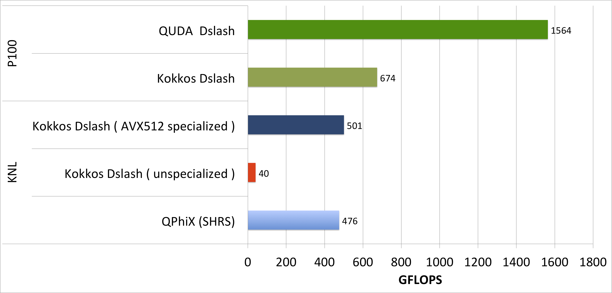
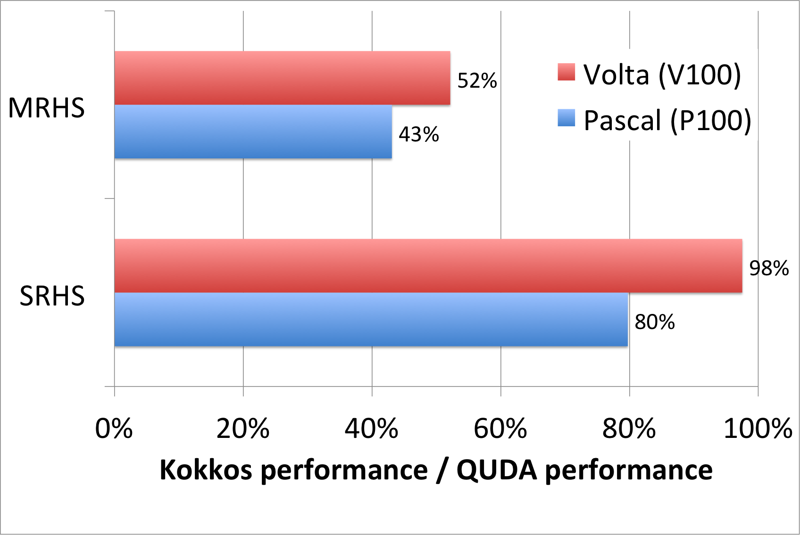

# Results
## Kokkos
In order to assess the performance on KNL and GPU architectures, we compare against the highly optimized libraries [QPhiX](https://github.com/JeffersonLab/qphix) and [QUDA](https://github.com/lattice/quda) respectively. Those two codes should set the upper bar of what can be achieved on the corresponding architectures for the given problem. Note that these libraries can additionally employ some algorithmic improvements which we did not use in our simple test case. However, it is possible to switch most of these optimizations off to allow for better comparisons with our portable code. Two optimization features of the libraries which we have not turned off were i) in the case of QPhiX, cache blocking remains enabled and ii) QUDA performs a wide-ranging autotuning as regards block sizes, and shared memory use to identify its optimal launch parameters. Both these features are integral to these libraries and could not be turned off. The vectorization in both frameworks is performed over lattice sites and not over multiple right hand sides as in our testcase. However, QUDA supports a multiple-right hand side implementation which we can compare against, but must bear in mind that it does not rely on vectorization over right hand sides like our implementation. However, it still benefits from gauge field reuse. Due to it not vectorizing over the right hand sides, but over lattice sites, it may have have a different available space of kernel launch parameters and an entirely differentperformance profile from our implementation in the MRHS case.

On the CPU, we additionally compare our code to a plain C++ as well as to a legacy SSE-optimized Wilson dslash operator, both available through the [Chroma framework](https://jeffersonlab.github.io/chroma/). Those two codes should act as some kind of lower bar for our performance comparisons. Because of different vetorization behaviour in our kokkos dslash. we split our results summary into two parts, i.e. one for the single and one for the multiple right-hand-sites case.

## Single Right-Hand-Side (SRHS)

The performance comparison for this case is shown below. These performance measurements were carried out using a lattice of size V=32^4^ sites, in single precision (```float```) arithmetic. The KNL results used the KNL nodes from Cori, and the final KNL numbers came from nodes booted into **flat-quad** mode and pinned into MCDRAM using ```numactl -m 1```. Our GPU results were carried out on the nodes of SummitDev at OLCF, and on in-house resources at NVIDIA by KateClark. Kate found that using CUDA-9RC gave significantly higher performances than CUDA-8, and so we quote the CUDA-9 numbers here.


Recall that in these tests, the Wilson operator acts on a single right-hand-side and we do not use a special, vectorization-friendly data layout such as the virtual node layout of Grid or the tiled layout of QPhiX. This implies that the compiler has to find vectorization opportunities on its own. Our Kokkos code with CPU-backend seems to fail in this respect, whereas for the GPU-backend the SIMT parallelization seems to work, as the code achieves about 80% of the QUDA performance number. It is interesting that the plain ```cpp_wilson_dslash```, which does neither use sophisticated data layouts nor explicit vectorization statements, does better in this respect. One difference between our code, and ```cpp_wilson_dslash``` is our reliance on the ```complex<>``` datatype in the Kokkos test-code, whereas in ```cpp_wilson_dslash``` this is an explicit array dimension of length 2.  We suspect that the compiler has problems dealing with the templated ```Kokkos::complex<>``` data-type, however, we did a quick and dirty experiment on the CPU replacing ```Kokkos::complex<>``` with ```std::complex``` from C++. This did not improve things, and so we do not think there is anything Kokkos specific with this issue.  Employing a vectorization and cache friendly data layout, one might be able to drive the Kokkos performance up to the QPhiX value. However, this has to be done carefully in the sense that certain data layouts might help on one architecture but might lead to performance penalties on another architecture. It is worthwhile exploring this aspect in the future.


## Multiple Right-Hand-Sides (MRHS)

The performance results for this case are displayed below. In this case on the CPU we chose to use 8 right hand sides (8 floating point complex numbers = 16 floats = vector register length), and correspondingly we lowered the volume by a factor of 8 to compensate to V=16^3^x32 sites.
In our subsequent GPU tests, we kept this same volume, but increased the number of right hand sides to 16 which is the natural warp size (and hence likely 'SIMD' size) for GPUs.



In this case, we chose a data layout which encourages vectorization over the right-hand-sides (Kokkos Dslash unspecialized) or explicitly do so by using vector intrinsics (Kokkos Dslash - AVX512 specialized) on CPU and (Kokkos Dslash) on GPU. We see a big improvement in the AVX512 specialized case, which suggests that automatic vectorization fails for our Kokkos code. Therefore, currently we encourage using SIMD datatypes or making use of explicit vectorization through intrinsics when using Kokkos. In our case, this required only a small amount of specialization and with this modification the Kokkos code was able to beat the (SRHS) QPhiX benchmark. This was really very ecouraging, as it suggested that the impediments to performance did not actually arise from Kokkos itself, but mostly out of the behaviour of compilers. 

On the GPU however, Kokkos' performance is very low compared to the QUDA benchmark. While Kokkos wa able to achieve 80% of the QUDA performance for the SRHS case, it only achieves 43% for the MRHS case. More importantly, the performance for SRHS and MRHS are are similar on the GPU (SRHS ran at 610 GFLOPS, MRHS ran at 674 GFLOPS). This significant performance difference between the QUDA and Kokkos MRHS codes might be attributed to algorithmic differences between the two implementations. As noted earlier, in the QUDA code SIMT `vectorization' is effectively performed over lattice sites, achieved by using a specific layout and QUDA uses a wide ranging performance autotuning mechanism. 

We also compared the performances of the Kokkos and QUDA Dslash implementation on both Pascal and Volta architectures -- the measurements were carried out by Kate Clark of NVIDIA using internal NVIDIA V100 hardware.



The plot shows that our Kokkos kernel achieves significantly bigger fractions of the QUDA performance on Volta than on Pascal. On Pascal output from the Visual Profiler indicated that our Kokkos code was bound by memory and instruction latencies, and that compared to QUDA, we had a relatively lower percentage of Floating point, and higher percentages of Instruction and Control instructions than the QUDA benchmark. Volta's design bring significant latency reductions compared to Pascal, which makes it better able to run latency bound codes such as our MRHS Dslash implementation with Kokkos. In any case even though the Kokkos MRHS performance slightly excedes the Kokkos SRHS performance on the GPUs and the Kokkos MRHS performance on P100 slightly exceeds Kokkos MRHS performnace on KNL, nonetheless the GPU Kokkos MRHS implementation does not exploit the performance potential of the GPU to the same extent that the QUDA Library does. Whether this can actually be achieved will require future work.


## Summary
We could show that Kokkos can be used to write performant Dslash implementations for both CPU and GPU architectures. We summarize our performance achievment in the table below:

|      | GPU  | KNL  |
|------|------|------|
| SRHS | Good | Poor |
| MRHS | OK   | Good |

However, it is likely that the poor behavior in the case of KNL SRHS is not due to Kokkos, but to compiler being unable to find sufficient (if any) vectorization opportunity, which also will cause issues for memory traffic, i.e. if data is not read/written using aligned vector loads/stores. The underlying cause for the low performance of MRHS compared to QUDA on GPUs is still being investigated, for example, it is still up in the air as to whether latencies could be reduced by reducing indexing arithmetic (e.g. with Kokkos subviews) or memory latencies could be reduced, e.g. by loading the gauge field into shared memory. It is likely that on the KNL, starting from the multi-right hand side Dslash we could probably move to a better, vectorized SRHS operator, for example by adopting the virtual node layout of Grid. It is also likely that such an operator would have a reasonable (OK) performance on the GPUs based on the measurements made with the MRHS operator on GPUs. However, it is not immediately clear whether it would outperform the most naive implementation for SRHS which achieves 98% of QUDA performance on Volta. This leaves us with a more difficult performance portbaility question: Even if the code itself is performance portable (similar absolute GFLOPS performance on both CPU and GPU), in terms of extracting maximum available performance from a given architecture, is the algorithm itself performance portable?

