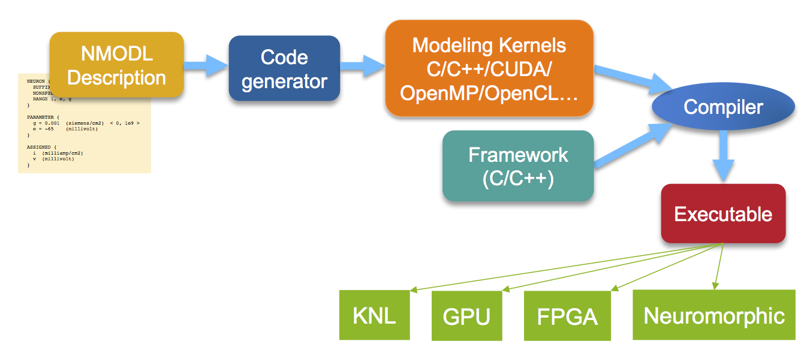

Tim and Bronson to Write

##Examples

###NMODL, A DSL for Computational Neuroscience

[NMODL](http://www.neuron.yale.edu/neuron/static/docs/help/neuron/nmodl/nmodl.html),
an evolution of the earlier MODL, is designed for neuroscientists to enter
neural tissue models into the NEURON tissue simulation code. The large-scale
HPC branch of the simulation code, CoreNEURON, is central to the [Blue Brain
Project](http://bluebrain.epfl.ch/) at EPFL, which is itself key to the brain
simulation component of the larger European Brain Project.

CoreNEURON is essentially solving a large set of coupled nonlinear ODEs
modeling electrochemistry and other aspects of neural tissue behavior. NMODL
reflects this, having key abstractions for dependent/independent variables and
their derivatives in the equations; specifying chemical reactions; and
maintaining consistency of units. Handling of units is important as
experimental neuroscience is an important driver of the models. Single lines
of NMODL are translated potentially into many lines of C code---lines which
the neuroscientist does not have to write (and get correct). Here is an
example showing some NMODL syntax [[3]](#nmodl_blog_post):

```
NEURON {
  SUFFIX leak
  NONSPECIFIC_CURRENT I
  RANGE i, e, g
}

PARAMETER {
  g = 0.001  (siemens/cm2)  < 0, 1e9 >
  e = -65    (millivolt)
}

ASSIGNED {
  i  (milliamp/cm2)
  v  (millivolt)
}
```

NMODL is part of the performance portability strategy for CoreNEURON. The code
generator produces code targeting specified architecture, using
OpenMP/CUDA/OpenMP/vector intrinsics/OpenCL as appropriate. This allows for
highly optimized compiled code. The generic components of the CoreNEURON
framework are optimized by experts, independently of the models coming in from
NMODEL. Here is a sketch of the overall pipeline; in green are example
specific hardware architectures targeted:




####References

1. M. L. Hines and N. T. Carnevale, ["Expanding NEURON's Repertoire of
Mechanisms with
NMODL,"](http://ieeexplore.ieee.org/stamp/stamp.jsp?tp=&arnumber=6789741&isnumber=6789470)
in Neural Computation, vol. 12, no. 5, pp. 995-1007, May 1 2000.  doi:
10.1162/089976600300015475

2. [NMODEL Model Description Language](http://www.neuron.yale.edu/neuron/static/docs/help/neuron/nmodl/nmodl.html)

3. <a name="nmodl_blog_post"></a>[Nerd Food: Tooling in Computational Neuroscience - Part I: NEURON](http://mcraveiro.blogspot.com/2015/11/nerd-food-tooling-in-computational.html)


